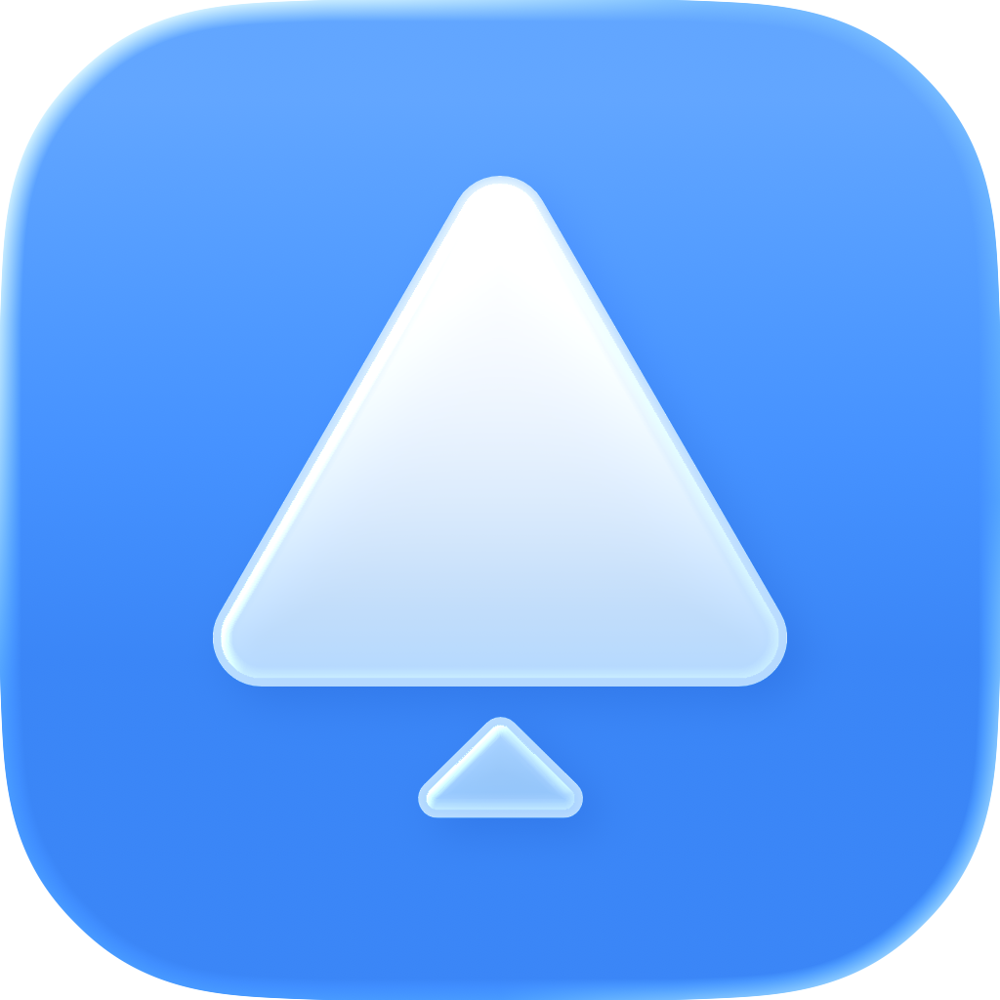

# n8n-nodes-PushBell

  

This is an n8n community node for sending push notifications via the [PushBell API](https://PushBell.info).

[n8n](https://n8n.io/) is a [fair-code licensed](https://docs.n8n.io/reference/license/) workflow automation platform.

[Installation](#installation)
[Operations](#operations)
[Credentials](#credentials)
[Compatibility](#compatibility)
[Usage](#usage)
[Resources](#resources)

## Installation

Follow the [installation guide](https://docs.n8n.io/integrations/community-nodes/installation/) in the n8n community nodes documentation.

## Operations

- Notifications
    - Create a new notification with title and description

## Credentials

This node uses an API key for authentication.

1. Open the PushBell app on your device.
2. Go to **Settings > Manage API Keys**.
3. Generate a new API key.
4. Copy the key into your n8n **PushBell API** credentials.

## Usage

1. In n8n, create new credentials of type **PushBell API** and paste your API key.
2. Add the **PushBell Node** to a workflow.
3. Fill in **Title** and **Description** fields, or map them from previous nodes.
4. Execute the workflow. A notification will be delivered to your devices.

## Compatibility

Compatible with n8n@1.60.0 or later

## Resources

* [PushBell Website](https://pushbell.info)
* [App Store](https://apps.apple.com/de/app/pushbell/id6474076842?l=en-GB)
